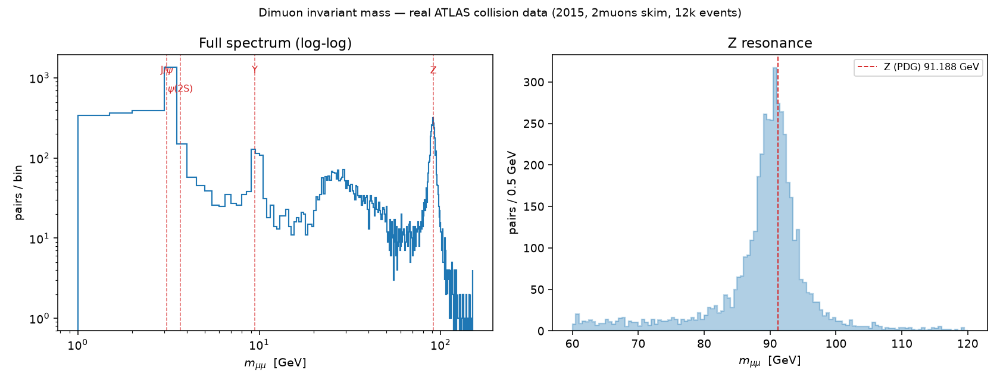

# COLLIDER

An interactive laboratory for real ATLAS collision data: browse events, inspect
them in 3D, and run a trained classifier over their physics features — with an
honest account of what the model knows and what it doesn't.

Built on [ATLAS Open Data](https://opendata.cern.ch/record/93910) (13 TeV,
2015–2016, CC0).

<p align="center">
  
</p>

---

## It finds real particles

The first thing this project does is prove its own arithmetic. Reconstructing
the invariant mass of muon pairs from 124,935 real 2015 collision events
reproduces four known resonances:

| Resonance | Measured | PDG | Difference |
|---|---|---|---|
| J/ψ | 3.095 GeV | 3.0969 | **−0.06%** |
| ψ(2S) | 3.675 GeV | 3.6861 | −0.3% |
| Υ(1S) | 9.435 GeV | 9.4603 | −0.26% |
| Z | 90.750 GeV | 91.188 | −0.48% |

Every peak sits slightly low, by an amount that grows with mass — the signature
of final-state radiation, not a calibration error. The J/ψ agreeing to 2 MeV is
what rules out a momentum-scale problem.

This runs in CI. If the peaks move, the build fails, because everything
downstream would be invalid.

---

## What it does

**Explore** a curated set of 120 events — real Z→μμ candidates from collision
data and simulated H→ZZ→4ℓ signal and background, each badged.

**Inspect** one in a 3D display built from published ATLAS detector dimensions.
Tracks follow true helices in the 2 T solenoid and stop where their physics says
they stop: electrons and photons in the EM calorimeter, jets in the hadronic
calorimeter, muons out to the muon chambers.

**Analyse** it with a gradient-boosted classifier, and see the per-event SHAP
contributions that moved the score.

**Read the spectrum**, recut it interactively, and watch a plausible cut fail.

---

## What it refuses to do

The constraints are the point, so they are listed before the results.

**Labelled data is simulation.** A real collision carries no truth label —
nobody knows what any individual event *was*. The classifier is trained and
evaluated entirely on Monte Carlo, so a score on measured data has nothing to
check it against. Every event is badged `measured` or `simulated`, and the
schema refuses to construct a measured event carrying a truth label.

**The output is a discriminant, not a probability.** The training class balance
is a choice we made, not a physical prior, so `0.975` is not an 87%-style
confidence. The threshold is always shown beside it.

**Absent values are reported, never invented.** The two-muon events carry no
score at all: the model consumes four-lepton features, and a two-muon event has
no second lepton pair. Rather than zero-fill the gaps to force a number, the
payload says why it can't.

**Nothing here is an ATLAS measurement.** The signal is gluon-fusion production
only. The background is the irreducible ZZ→4ℓ only — real data before selection
is dominated by fake leptons, which this does not model. Background statistics
in the mass window carry ~27% uncertainty, so significance differences are not
resolvable and are not claimed.

---

## Selected results

| | |
|---|---|
| Classifier test AUC | **0.9882** (XGBoost, 14 features) |
| Baseline AUC | 0.9134 (logistic regression) |
| Event payload | **826 B** gzipped, against a 100 KB budget |
| JS on the landing page | **134 KB** — the 3D bundle loads only where a canvas mounts |
| Tests | **136** |

Two findings worth the click:

- **MC weights invert the sample by ~1,000×.** We generated 37 signal events per
  background event; nature produces 28 background per signal.
  → [`docs/FINDINGS.md`](docs/FINDINGS.md#3-mc-weights-invert-the-sample-by-a-factor-of-1000)
- **Raw 4-lepton data is 99.97% fake leptons.** Full selection takes it from
  3,708 events to 1.
  → [`docs/FINDINGS.md`](docs/FINDINGS.md#4-raw-4-lepton-data-is-dominated-by-fake-leptons)

`m_4l` is deliberately withheld from the model. It is the strongest
discriminator available, and cutting on a score that depends on it would carve a
bump-shaped hole in the very spectrum we want to read.

---

## Running it

```bash
uv venv && uv pip install -e ".[dev]"
cd web && npm install && cd ..
```

Fetch the source data (see [`docs/DATA_SOURCES.md`](docs/DATA_SOURCES.md) for
files and checksums), then:

```bash
python scripts/prepare_dataset.py      # selection, features, weights
python scripts/train_and_register.py   # train and register the model
python scripts/export_events.py        # curated event artifacts + predictions
python scripts/export_distribution.py  # the mass spectrum
```

```bash
./scripts/dev.sh
```

API on `:8123`, web on `:3000`. Tests with `pytest`.

---

## Layout

```
src/collider/      physics, features, ML, API
scripts/           pipeline stages and figure generation
tests/             136 tests, including the Z-peak check
web/               Next.js frontend
docs/              findings, decisions, design
data/              raw (gitignored) and curated artifacts
```

## Documentation

| | |
|---|---|
| [`docs/FINDINGS.md`](docs/FINDINGS.md) | Every measured result, with its script and guarding test |
| [`docs/SCIENTIFIC_INTEGRITY.md`](docs/SCIENTIFIC_INTEGRITY.md) | The rules, and why each one changes the schema |
| [`docs/DATA_SOURCES.md`](docs/DATA_SOURCES.md) | Datasets, DOIs, licences, access dates |
| [`docs/decisions/`](docs/decisions/) | Architecture decision records |
| [`docs/design/`](docs/design/) | Visual brief and theme |
| [`docs/SPEC.md`](docs/SPEC.md) | The original project specification |

## Licence

Code is MIT ([`LICENSE`](LICENSE)). ATLAS Open Data is
[CC0 1.0](https://creativecommons.org/publicdomain/zero/1.0/); citation of the
data and acknowledgement of the ATLAS Collaboration is requested — see
[`docs/DATA_SOURCES.md`](docs/DATA_SOURCES.md).

Artwork and characters are original. No copyrighted assets are used, and a test
fails the build on a copyrighted reference in the dialogue.
